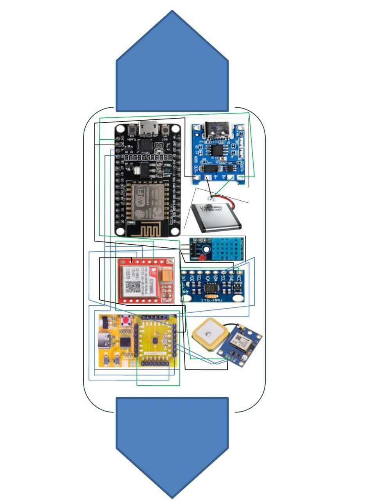

# PawCare-Smart Health Tag for Stray Dog Welfare
## Introduction
The VSDSquadron Mini (CH32V003F4U6) is a compact and powerful microcontroller designed for embedded applications. This project integrates multiple communication and sensor modules to create a fully functional IoT-based system. The objective is to enable wireless connectivity, GSM communication, motion tracking, temperature monitoring, and GPS tracking while efficiently managing limited UART, I2C, and GPIO resources. The firmware is designed to handle data acquisition, processing, and transmission, making it suitable for applications such as remote monitoring, smart tracking, and IoT automation.
## Overview
This repository contains the circuit connections and firmware setup for the VSDSquadron Mini (CH32V003F4U6-based) microcontroller integrating multiple modules. The purpose of this setup is to provide wireless connectivity, GSM communication, motion tracking, temperature monitoring, and GPS tracking in a compact and efficient manner.
## Components required with Bill of Materials
| Item                   | Quantity | Description                                                   | Links to Products                                      |
|------------------------|----------|---------------------------------------------------------------|---------------------------------------------------|
| VSD Squadron Mini      | 1        | Microcontroller board                                        | [VSD Squadron Mini ](https://pages.razorpay.com/vsdsqmnMAY24)        |
| ESP8266          | 1        |    Microcontroller board                         | [esp8266](https://www.amazon.in/esp8266/s?k=esp8266)       |
| DHT11| 1        | temperature sensor                   | [temperture sensor](https://www.amazon.in/EPICTAC%C2%AE-3-3V-5V-Temperature-Humidity-Raspberry/dp/B092SFGF52)        |
| Jumper Wires           | 1 set    | Male-to-male and female-to-male jumper wires                 | [Jumper Wires](https://amzn.in/d/abTh8bo)           |
| Micro USB Cable        | 1        | For programming and power supply                             | [Micro USB Cable](https://amzn.in/d/9b3ttSo)        |
| GPS       | 1        | location tracker                            | [gps](https://www.amazon.in/NEO-8M-GPS-Module-Micro-Interface/dp/B0C1V8P4HJ/ref=asc_df_B0C1V8P4HJ/?tag=googleshopdes-21&linkCode=df0&hvadid=709963085501&hvpos=&hvnetw=g&hvrand=17686159335378910175&hvpone=&hvptwo=&hvqmt=&hvdev=c&hvdvcmdl=&hvlocint=&hvlocphy=1007812&hvtargid=pla-2350755046754&mcid=fbf4243ee00f3b43ab77553dc337f7e8&gad_source=1&th=1)        |
| Sim800L       | 1        | gsm module                             | [GSM MODULE](https://www.amazon.in/Robodo-Electronics-SIM800LTTL-Module-Quad-Band/dp/B07B92T3K7/ref=asc_df_B07B92T3K7/?tag=googleshopdes-21&linkCode=df0&hvadid=709963085501&hvpos=&hvnetw=g&hvrand=13047581882593455737&hvpone=&hvptwo=&hvqmt=&hvdev=c&hvdvcmdl=&hvlocint=&hvlocphy=1007812&hvtargid=pla-882892903166&psc=1&mcid=e76a14c065e03bbab6df00c1c2a2b50d&gad_source=1)        |
| Accelerometer      | 1        | movement tracker                            | [mcu6050](https://amzn.in/d/9b3ttSo)        |


## Pin Connections
The VSDSquadron Mini (CH32V003F4U6-based) has limited UART, I2C, and GPIO pins, so we need to assign them carefully.

1️) ESP8266 (WiFi Module)
ESP8266 TX → VSDSquadron Mini PD6 (UART RX)
ESP8266 RX → VSDSquadron Mini PD5 (UART TX)
ESP8266 VCC → 3.3V
ESP8266 GND → GND

2️) SIM800L (GSM Module)
SIM800L TX → VSDSquadron Mini PD6 (Shared UART RX with ESP8266)
SIM800L RX → VSDSquadron Mini PD5 (Shared UART TX with ESP8266)
SIM800L VCC → 4.2V Power Supply
SIM800L GND → GND

3️) MPU6050 (Accelerometer & Gyroscope)
MPU6050 SDA → VSDSquadron Mini PC1 (I2C SDA)
MPU6050 SCL → VSDSquadron Mini PC2 (I2C SCL)
MPU6050 VCC → 3.3V
MPU6050 GND → GND

4️) DHT11 (Temperature & Humidity Sensor)
DHT11 Data → VSDSquadron Mini PD0
DHT11 VCC → 3.3V
DHT11 GND → GND

5️) NEO-6M GPS Module
GPS TX → VSDSquadron Mini PA0 (Software Serial RX)
GPS RX → VSDSquadron Mini PA1 (Software Serial TX)
GPS VCC → 3.3V
GPS GND → GND
## Pinout Diagram



## Working Code
```
#include <Wire.h>            // I2C for MPU6050
#include <SoftwareSerial.h>  // Soft Serial for GPS & GSM
#include "DHT.h"             // DHT11 library
#include <ch32v00x.h>
#include <ch32v00x_gpio.h>
// PIN Assignments
#define DHTPIN PD0
#define DHTTYPE DHT11

// Objects for sensors & modules
DHT dht(DHTPIN, DHTTYPE);
SoftwareSerial gpsSerial(PA0, PA1);  // GPS RX, TX
SoftwareSerial gsmSerial(PD5, PD6);  // SIM800L RX, TX

// Global variables
float lastTemperature = 0.0;
float lastHumidity = 0.0;
bool movementDetected = false;

// Function to send SMS alert via SIM800L
void sendAlertSMS(String message) {
    Serial.println("Sending SMS Alert...");
    gsmSerial.println("AT+CMGF=1");  // Set SMS mode
    delay(1000);
    gsmSerial.println("AT+CMGS=\"+91xxxxxxxxxx\"");  // Replace with volunteer or vertinary doctor's mobile number
    delay(1000);
    gsmSerial.print(message);
    delay(1000);
    gsmSerial.write(26);  // End SMS command
    delay(5000);
}

// Function to read & parse GPS data
void readGPS() {
    String gpsData = "";
    while (gpsSerial.available()) {
        char c = gpsSerial.read();
        gpsData += c;
    }
    Serial.print("GPS Raw Data: ");
    Serial.println(gpsData);
    // Extract latitude & longitude (Implement further parsing)
}

// Function to read DHT11 sensor
void readDHT() {
    float temperature = dht.readTemperature();
    float humidity = dht.readHumidity();

    if (isnan(temperature) || isnan(humidity)) {
        Serial.println("DHT11 Sensor Error!");
        return;
    }

    Serial.print("Temperature: "); Serial.print(temperature); Serial.println("°C");
    Serial.print("Humidity: "); Serial.print(humidity); Serial.println("%");

    // Send alert if temperature goes too high
    if (temperature > 40.0 && lastTemperature <= 40.0) {
        sendAlertSMS("Warning! High temperature detected.");
    }

    lastTemperature = temperature;
    lastHumidity = humidity;
}

// Function to detect motion from MPU6050
void detectMotion() {
    Wire.beginTransmission(0x68); // MPU6050 I2C Address
    Wire.write(0x3B); // Accelerometer register
    Wire.endTransmission(false);
    Wire.requestFrom(0x68, 6, true);

    int16_t AccX = Wire.read() << 8 | Wire.read();
    int16_t AccY = Wire.read() << 8 | Wire.read();
    int16_t AccZ = Wire.read() << 8 | Wire.read();

    float ax = AccX / 16384.0;
    float ay = AccY / 16384.0;
    float az = AccZ / 16384.0;

    if (ax > 2.0 || ay > 2.0 || az > 2.0) {
        Serial.println("⚠ Motion Detected!");
        movementDetected = true;
        sendAlertSMS("PawCare Alert: Sudden movement detected!");
    } else {
        movementDetected = false;
    }
}

void setup() {
    Serial.begin(9600);
    gpsSerial.begin(9600);
    gsmSerial.begin(9600);
    Wire.begin();
    dht.begin();

    Serial.println("PawCare System Initialized!");
}

void loop() {
    readDHT();     // Read temperature & humidity
    readGPS();     // Read GPS location
    detectMotion(); // Check for sudden movements

    delay(2000); // Delay for stability
}
```

## Output Video
https://drive.google.com/file/d/10mVwB8beWYo9Sr0sMCDud-_ZU_CJZYiU/view?usp=drive_link
## [Notes]
- **ESP8266 and SIM800L share the same UART (PD6 & PD5)**, requiring careful switching using software control.
- **SIM800L requires a stable 4.2V power source**, ensuring sufficient current (~2A peak) with a capacitor for stability.
- **GPS module runs on software serial (PA0 & PA1)**, which may need baud rate tuning for optimal performance.
- **MPU6050 operates on I2C and should have proper pull-up resistors if necessary.**

## Conclusion & Results
This project successfully integrates multiple communication and sensor modules with the VSDSquadron Mini microcontroller, effectively utilizing limited GPIO and UART resources. The system allows for real-time data acquisition, wireless transmission, and GPS tracking. The implemented firmware efficiently manages UART switching and sensor data processing.

**Results:**
- **GPS tracking with NEO-6M**, providing location data over software serial.
- **GSM functionality established using SIM800L**, allowing SMS and call operations.
- **Accurate motion sensing through MPU6050**, providing real-time gyroscope and accelerometer readings.
- **Temperature and humidity monitoring with DHT11**, ensuring environmental tracking.
- **WiFi connectivity achieved via ESP8266**, enabling remote communication.

Overall, the project successfully demonstrates a compact and efficient IoT-based system that can be extended for various real-world applications such as smart tracking, remote monitoring, and data logging.

## Next Steps
- Implement firmware for managing UART switching dynamically.
- Upload the complete circuit schematic.
- Conduct individual module tests before full integration.
